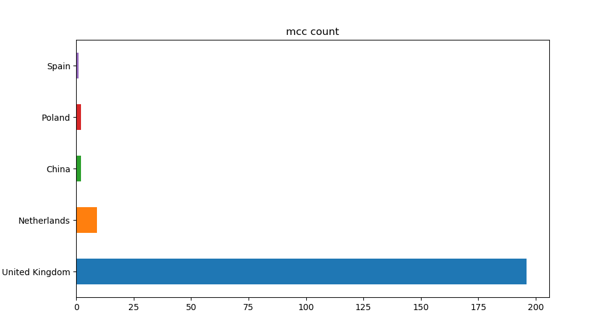
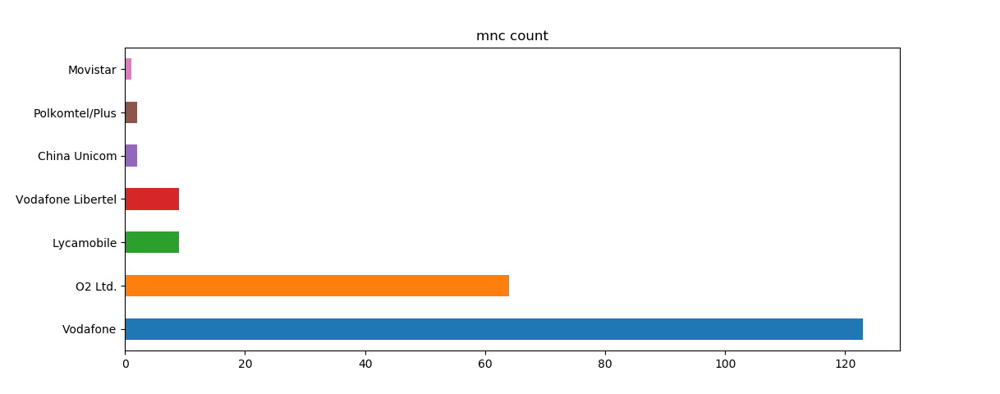
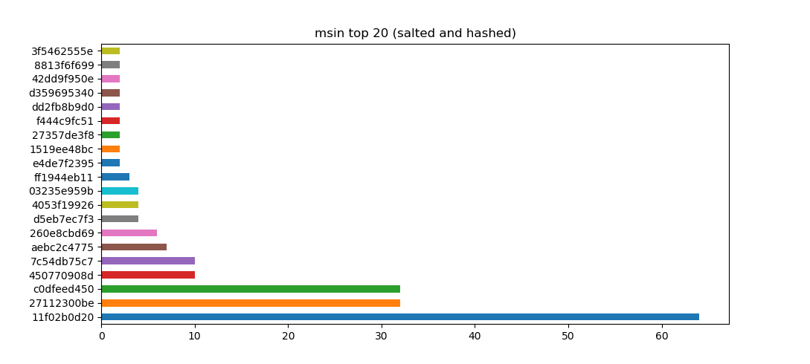

# GSM, are you still there

Uses a  cheap and cheerful [RTL SDR](https://www.rtl-sdr.com/about-rtl-sdr/) to keep a beady eye on when this landmark communications network bites the dust.

Be aware of any legislation regards both passive capture, and the processing, of radio signals where you are.

Be a good citizen and always properly anonymise and/or delete any [Personally Identifiable Information](https://en.wikipedia.org/wiki/Personal_data) stumbled upon doing network research.

IMHO that includes IP addresses as well, but that is another story.

## Dependancies

[rtl_sdr](https://www.rtl-sdr.com/rtl-sdr-quick-start-guide/)

[gr-gsm](https://osmocom.org/projects/gr-gsm/wiki/Installation)

[mcc-mnc table](https://raw.githubusercontent.com/musalbas/mcc-mnc-table/master/mcc-mnc-table.csv)

[python3-matplotlib](https://matplotlib.org/stable/faq/installing_faq.html)

[python3-pandas](https://pandas.pydata.org/pandas-docs/stable/getting_started/install.html)

[tshark](https://tshark.dev/setup/install/)

[kalibrate-rtl](https://github.com/steve-m/kalibrate-rtl)   There are also ubuntu repos out there and specific intrsuctions for installing on a Pi.

## Setup

```console
python3 make-mcc-mnc-db.py mcc-mnc-table.csv mcc-mnc.db
```


## Survey

Two scans are made, one to get the RTL error offset and the next the GSM base stations proper. 

Note: This script creates start.sh used below.

Note: A "gain" value of 40 in survey.sh worked best for me, you may need to change this. With this value, rx power as indicated by the output file scan.txt needed to be greater than 200000 for consistent decoding, you may need to edit "power_threshold" in survey.sh to reflect your environment as well.

```console
bash ./survey.sh
```

## Scan

Note: If you want to use networked or multiple receivers edit start.sh and add --args=rtl_tcp=a.b.c.d:1234 etc as appropriate. 

To start collecting IMSIs (will be put into imsi.csv):

```console
sudo bash ./start.sh
```

To stop collecting press Control-C then:

```console
sudo bash ./stop.sh
```

## Processing

Run the following to anoymise the IMSI data collected and produce visualisations like the examples below:

```console
bash ./process.sh
```






